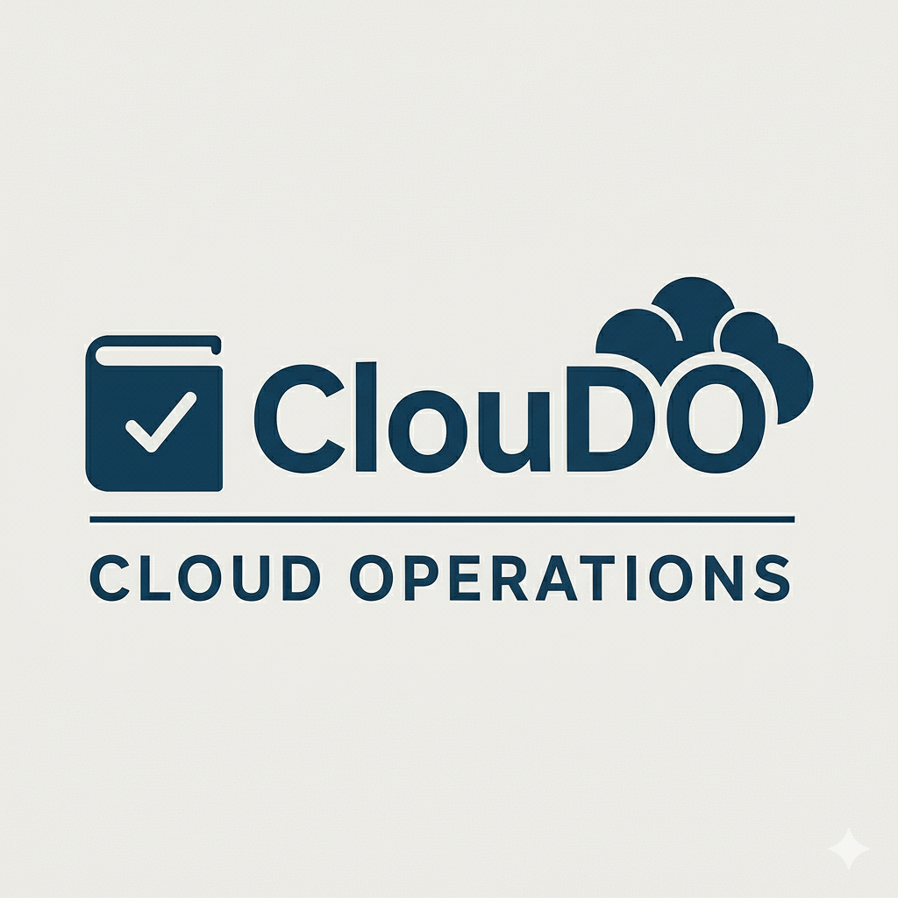

# ClouDO - Centralized runbook automation for manual or event-driven execution

<p align="center">
  
</p>

## Overview

ClouDO centralizes the definition, execution, and governance of operational runbooks. It supports both manual invocation and event-driven triggers, enabling consistent, repeatable responses to incidents, maintenance tasks, and routine operations.

## Architecture Overview

At a high level, the system comprises:

- API/Controller: Validates requests, authorizes actors, and dispatches runs.
- Orchestrator: Resolves dependencies and manages run lifecycle.
- Executors: Perform steps (scripts, HTTP calls, cloud operations, etc.).
- Event Ingestion: Webhooks/queue listeners for event-driven runs.
- State & Storage: Metadata, run history, artifacts, and secret references.
- UI: Discovery, execution, approvals, and observability.

Centralized runbook automation for manual or event-driven execution.

## Getting Started

### Installation

- Clone the repository.
- Install Python dependencies as documented in the project (e.g., using pip).
- Configure environment variables and credentials as needed.

### Test environment

To set up test environment with pre-compiled schemas (test, test-2, test-3) you need `docker-compose` installed
on your machine. Then run on root folder `make test-env-start` to set up environment and test
on http://localhost:7071/api/Trigger.

```bash
curl http://localhost:7071/api/Trigger?id=test
```

To exec the test the runbook and try the workflow, use → http://localhost:7071/api/logs to see result and process status.

### Configuration

ClouDO supports the Terraform module with the complete installation on your Azure subscription.

For detailed infrastructure deployment instructions, see
the [Infrastructure as Code Documentation](src/core/iac/README.md).

### How to write a runbook

Actually the Runbooks can be written with `bash` & `python` programming language.

When the alert originates from Azure Kubernetes Service (AKS),
the runbook has the following environment variables available:

- **RESOURCE_ID**: The full Azure resource ID.
- **RESOURCE_RG**: The Azure Resource Group name.
- **RESOURCE_NAME**: The resource name.
- **AKS_JOB**: The originating job/name from the alert context (if available).
- **AKS_DEPLOYMENT**: The Kubernetes Deployment name related to the alert (if available).
- **AKS_NAMESPACE**: The Kubernetes namespace associated with the alert (if available).
- **AKS_POD**: The specific Kubernetes Pod name related to the alert (if available).
- **AKS_HPA**: The specific Kubernetes HPA name related to the alert (if available).
- **MONITOR_CONDITION**: The monitor state for the alert, e.g., "Fired" or "Resolved."

The runbooks have already integrated the azcli support and the python library for az management.

#### Log in on azure

If you need to write a runbook that works on Azure copy/paste this piece of code on top to
ensure manage identity login of ClouDO Worker.

```bash
# Ensure Azure login
if ! az account show >/dev/null 2>&1; then
  echo "Logging into Azure..."
  az login --identity --client-id "$AZURE_CLIENT_ID" >/dev/null
fi
```

### Example schemas

This is the example of schemas to map the runbooks to execute.

```
[
  {
    "partition_key": "generic",
    "entity": [
    {
      "id": "000-0000-0e0e00ww-wqesd",
      "name": "pippo",
      "description": "Hello Pippo V1!",
      "runbook": "check_sys.sh",
      "worker": "Runbook",
      "oncall": "true",
      "require_approval": "true"
    },
    {
      "id": "000-0000-0e0e00wa-wqesd",
      "name": "pippo",
      "description": "Hello Pippo V2!",
      "runbook": "check_sys.sh",
      "worker": "Runbook",
      "oncall": "false",
      "run_args": ""
    }]
  },
  {
    "partition_key": "infra",
    "entity": [
    {
      "id": "000-0000-0e0e00ww-wasdsa",
      "name": "infra-pippo",
      "description": "Hello Pippo INFRA!",
      "runbook": "test.py",
      "run_args": "-n 1000 --repeats 1000",
      "worker": "Runbook",
      "oncall": "false"
    }]
  },
  {
    "partition_key": "alert",
    "entity": [
    {
      "id": "12345678-1234-1234-1234-1234567890ab",
      "name": "smart-alert",
      "description": "SMART!",
      "runbook": "check_sys.sh",
      "worker": "Runbook",
      "oncall": "false"
    }]
  }
]
```

A generic partition entry defining a runbook entity named “pippo,”
with ID 000-0000-0e0e00ww-wqesd. It describes versioned metadata (“Hello Pippo V1!”),
points to the runbook script check_sys.sh, is executed by the Runbook worker,
and is not marked for on-call.

If oncall was set to `true` in case runbook fail an alert will be opened on Opsgenie.
